# VAARI — *"Your turn. On time."*

> **SIH 2026 · Problem Statement 26032**
> Ministry of Consumer Affairs, Food & Public Distribution · Department of Consumer Affairs (DoCA)
> Theme: Smart Automation · Category: Software

*`vaari` (वारी / ਵਾਰੀ) — "one's turn" in the Hindi–Punjabi wheat belt.*

---

## 1. The one-line difference

> **Every other team will build a system that tells farmers when to come.
> We build the one that tells them when *not* to come.**

The queue at a procurement centre is not caused by missing software. It is caused by **distrust**. Farmers arrive at 5 AM *because the system is unpredictable* — which is precisely what makes it unpredictable. Hand them a booking app and they will book a slot **and still show up at 5 AM.**

VAARI attacks the distrust, not the form-filling.

---

## 2. The problem, concretely

**Ramesh — Sehore district, MP. 40 quintals of wheat. Rabi season.**

| Day | What happens | Cost to Ramesh |
|-----|--------------|----------------|
| 1 | Hears from a neighbour the centre is buying. No official schedule reached him. Rents a tractor-trolley, drives 18 km at 5 AM. Finds 60 trolleys already queued. Gunny bags ran out at noon. | ₹1,500 rent |
| 2 | Sleeps beside his trolley in the yard. | ₹1,500 rent |
| 3 | Weighed at last. Moisture reads 13.5% against a 12% cap. **Rejected.** Told to dry it and return. | ₹1,500 rent, ₹0 earned |
| 8 | Returns. Sells. Receives a paper J-form. | — |
| 8 → ? | *When does the money arrive?* Nobody can say. Some neighbours were paid in 8 days, some in 6 weeks. His loan instalment is due. | Sleepless |

Multiply by 300 farmers at one centre. Three failures compound:

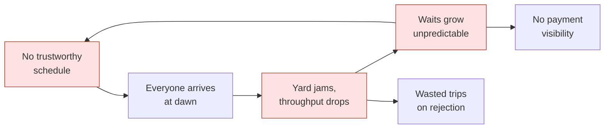

**It is a feedback loop.** Break the loop at one point and the whole thing unwinds.

---

## 3. Why existing systems don't already solve this

Several states run procurement portals today:

| State | System | What it does | What it does **not** do |
|---|---|---|---|
| Madhya Pradesh | e-Uparjan | Registration, SMS with date + centre | React when the day goes wrong |
| Punjab | Anaj Kharid | Registration, J-form, payment records | Tell a farmer to stay home |
| Haryana | Meri Fasal Mera Byora | Registration, slot/date allocation | Model actual centre capacity |

> ⚠️ **Verify each portal's current feature set before pitching.** A judge from DoCA will know them. You must be able to name them and say precisely what they lack.

They are **registration systems** — one-way, static, *"here is your date, good luck."*
VAARI is a **live operations system** — two-way, dynamic, capacity-modelled, and honest when it slips.

That distinction is the entire project.

---

## 4. Our answer: one causal chain, not a feature list

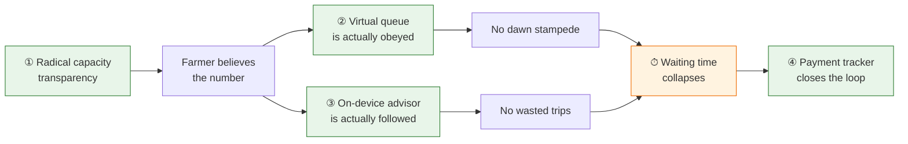

Each piece **needs** the others. A feature list can be copied in a weekend. A mechanism has to be understood.

---

## 5. Features, mapped to the problem statement

| PS requirement | VAARI feature | What makes it different |
|---|---|---|
| Farmer registration & slot booking | **Capacity-aware Slot Engine** | Slots derived from real constraints — gunny bags, weighbridges, labour, evacuation trucks — not a fixed number. Overbooking is impossible by construction. |
| Real-time queue management | **Virtual Queue + Live ETA** | Position is held *while you wait at home*. Geofence activates your token within 10 km. Arriving early gains you nothing — and the app says so. |
| SMS / app notifications | **Notification Ladder** | Push → SMS → IVR call → FPO kiosk. Material ETA changes reach a 2G feature phone in a village with no data. |
| Track procurement & payment status | **Payment Pipeline Tracker** | Five explicit stages, each timestamped, each with an SLA. Breach auto-escalates to the district officer. |
| Reduce congestion & waiting time | **Trip-Saver Advisor (on-device AI)** | Predicts rejection risk *before the trolley is loaded*, and recommends the slot with the lowest total cost to the farmer. Runs with **zero network**. |
| *(beyond the PS)* | **Cross-centre load balancing** | Centre A backed up 3 days, Centre B idle 9 km away → offer the swap. This is what actually *reduces* congestion district-wide. |
| *(beyond the PS)* | **Officer Operations Dashboard** | Live backlog heatmap, bag stock, evacuation lag. Fix the jam *before* it happens. |

---

## 6. System architecture

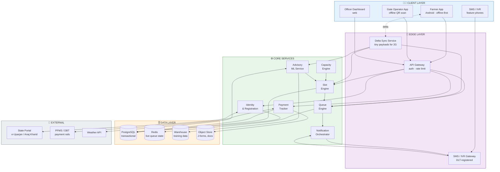

---

## 7. How it works — the farmer's journey

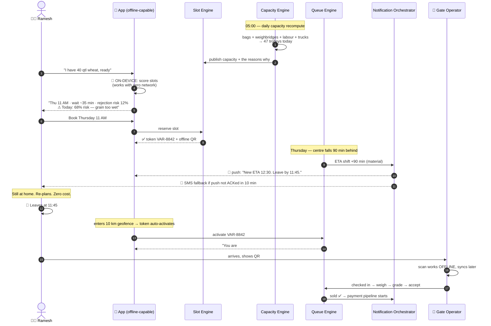

**The moment that matters is step 12–14.** Ramesh learns about the delay *while still at home*. That single interaction is the whole product.

---

## 8. Deep dive ① — Capacity-Aware Slot Engine

Most systems publish a fixed number of slots. Reality doesn't care about fixed numbers.

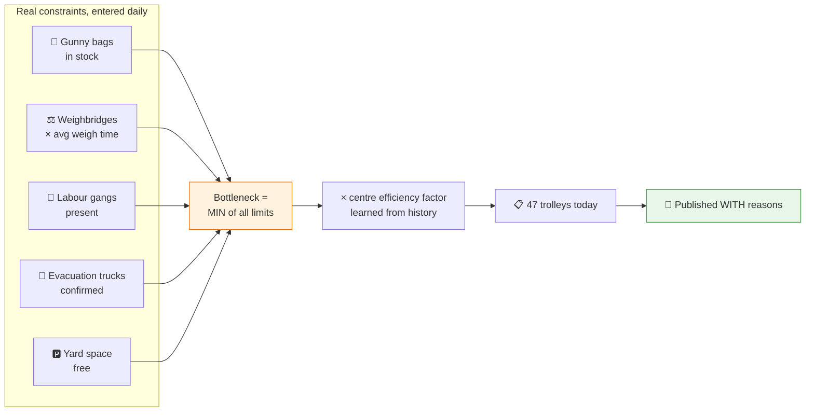

**Radical transparency is the feature.** The app doesn't say *"47 slots."* It says:

> **Centre Sehore-3 — 47 trolleys today**
> 3,400 gunny bags in stock · 1 weighbridge · 2 evacuation trucks confirmed
> *Limiting factor: gunny bags*

Nobody publishes this. It is exactly what makes a farmer believe the number — and belief is what makes the virtual queue work.

It also turns the officer dashboard into a real tool: the officer sees `limiting factor: gunny bags` **three days before** the yard jams.

> 📌 The `efficiency factor` is a calibration knob per centre, seeded at 1.0 and learned from actual vs. predicted throughput. Real centres are never the ideal on paper.

---

## 9. Deep dive ② — Virtual Queue & Live ETA

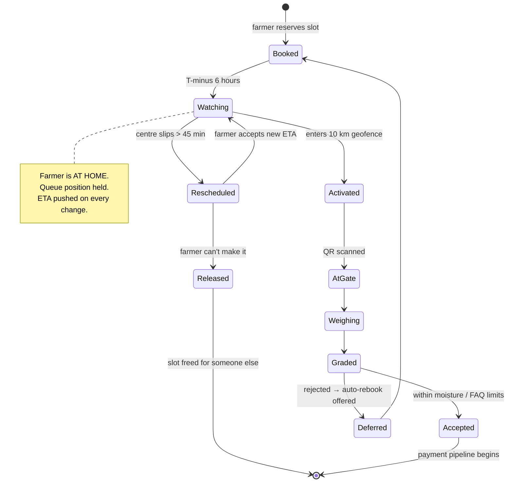

**Design rules that make this actually work:**

1. **Presence ≠ position.** Arriving at 5 AM changes nothing. The app states this plainly on the booking screen.
2. **Geofencing is client-side** (Android Geofencing API) — needs **no network** to fire.
3. **Released slots recirculate.** Ramesh can't come → someone 8 km away gets an SMS offering it.
4. **A rejection auto-offers a rebook**, so a bad day never becomes a lost sale.

---

## 10. Deep dive ③ — Offline-first & the notification ladder

> *"It should work under less network as farmers live in remote areas."*

This is a **hard architectural constraint**, not a nice-to-have. Everything below follows from it.

### The delivery ladder

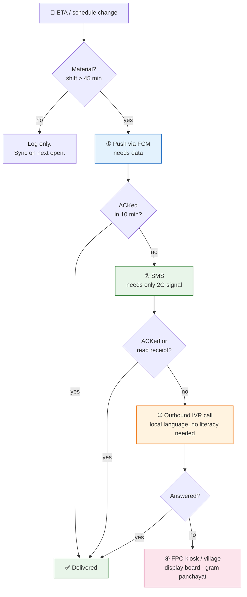

**Why the `Material?` gate exists:** SMS costs money at national scale. Gating on a 45-minute threshold cuts volume by an estimated order of magnitude while never hiding a change the farmer would act on. *(Threshold is configurable per state and should be tuned on pilot data.)*

### What the app does with zero network

| Capability | Works offline? | How |
|---|---|---|
| View my token + QR | ✅ | QR encodes a signed payload; verifiable offline by the gate app |
| See last-known ETA | ✅ | Cached, stamped **"as of 3 hours ago"** — never shown as fresh |
| Get slot recommendations | ✅ | On-device model — see §11 |
| Check rejection risk | ✅ | On-device model + cached weather |
| Book a slot | ⏳ | Queued locally, submitted on reconnect, confirmed by SMS |
| Payment status | ⏳ | Last synced value + timestamp |

### Sync design for 2G

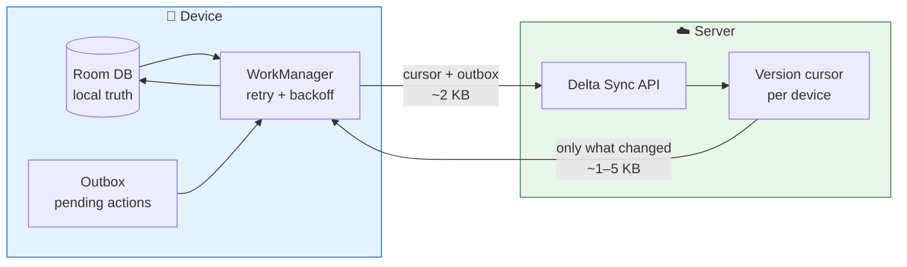

- **Delta sync, never full sync.** Device sends a version cursor; server returns only changes. Typical payload **1–5 KB** — completes on EDGE.
- **Local-first writes.** Every action lands in Room immediately, then an outbox drains via WorkManager with exponential backoff. The UI never blocks on the network.
- **Conflict rule:** server wins on slot allocation *(it owns scarce capacity)*; device wins on farmer preferences. Simple, predictable, no merge algebra.
- **Freshness is always visible.** Every cached screen carries *"as of HH:MM"*. A system that lies once about staleness is never trusted again.

---

## 11. Deep dive ④ — On-device AI advisor

> *"AI recommendation for timings which can run or reside offline."*

A large model on a ₹6,000 Android phone with no data connection is fantasy. Here is what actually works:

### Train in the cloud, score on the device

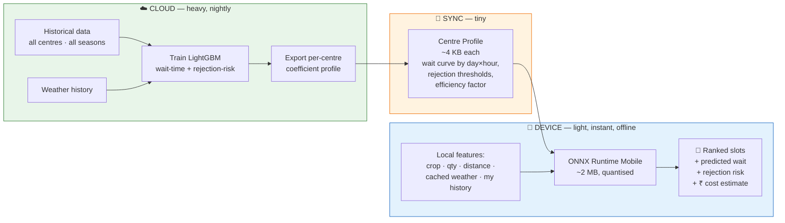

**The key move:** we ship **coefficients, not models**. A per-centre profile is ~4 KB. A farmer's 3 nearest centres = ~12 KB, syncable over 2G in seconds. The phone runs inference locally in milliseconds.

Result: **a farmer with no network for three days still gets a defensible recommendation** — clearly labelled *"based on data from 3 days ago."*

### What the advisor actually predicts

| Model | Inputs | Output | Why it earns its place |
|---|---|---|---|
| **Wait-time** | day-of-week, hour, centre profile, current backlog (last synced), seasonal peak curve | *"~35 min wait"* | Turns a slot into a decision |
| **Rejection risk** | self/FPO moisture reading, rainfall in village last 72 h, crop variety, centre's historical rejection pattern | *"68% risk — dry 2 days"* | **A rejected trip costs ₹1,500–4,000.** This is the money feature. |
| **Best-slot ranker** | both of the above + distance + trolley rent + farmer's stated urgency | Ranked slots with a **₹ cost** on each | Optimises the farmer's real cost, not our queue |

### Graceful degradation — never a blank screen

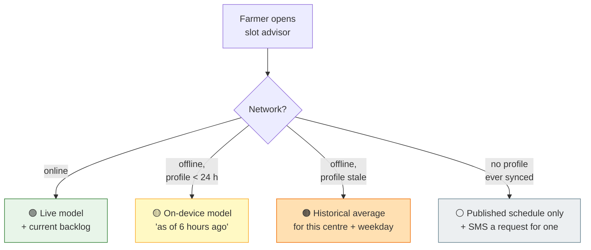

> 📌 **The advisor never fabricates confidence.** Each tier is visually distinct and labelled. Trust is the product; an overconfident wrong ETA destroys more value than no ETA at all.

---

## 12. Deep dive ⑤ — Payment pipeline tracker

The problem statement's *"uncertainty about procurement status"* is half the ask — and the half most teams forget.

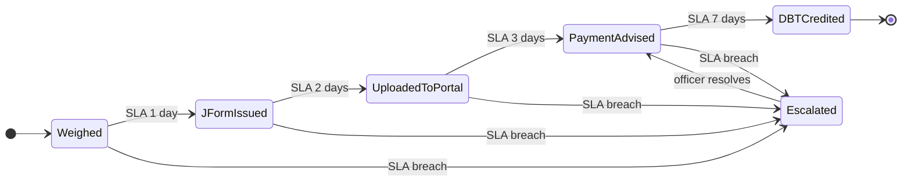

Every stage carries a **timestamp** and an **SLA**. On breach:

1. Farmer sees the stage stuck, with the reason and *who owns it*.
2. The district officer's dashboard raises it automatically.
3. No phone calls. No visits to the centre to ask "kab aayega paisa?"

> **SLA values above are illustrative** — set them from the actual state procurement policy you target.

---

## 13. Data flow, end to end

### The three loops

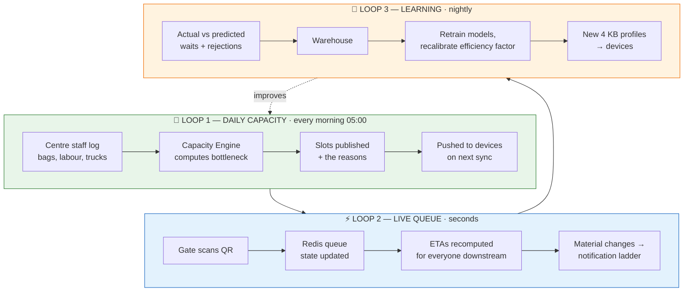

### Core data model

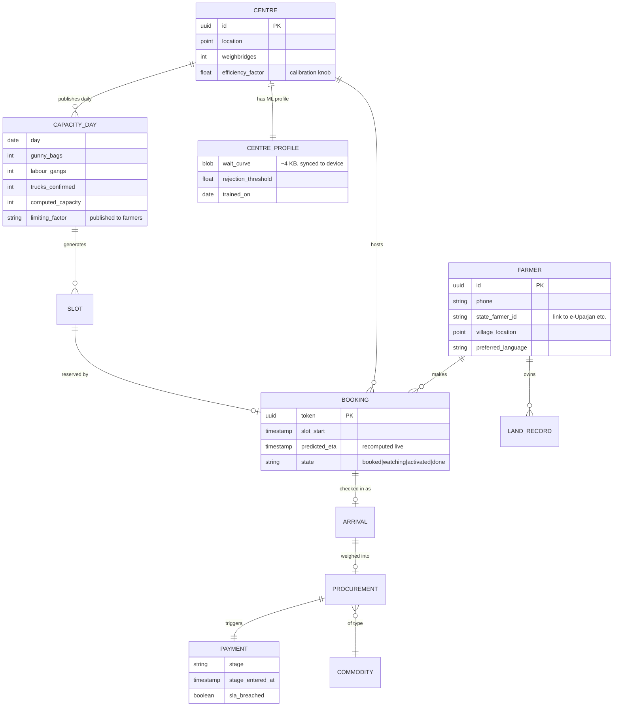

---

## 14. Tech stack

Deliberately boring. Boring survives a demo day and a government audit.

| Layer | Choice | Why |
|---|---|---|
| **Farmer app** | Kotlin + Jetpack Compose, **Room**, **WorkManager** | Room = offline truth; WorkManager = retry/backoff for free. Target **API 24+** — old phones are the actual user base. |
| **On-device ML** | **ONNX Runtime Mobile** (quantised) | ~2 MB, runs LightGBM exports. TFLite is the fallback if size becomes an issue. |
| **Backend** | **Python + FastAPI** | ML lives in the request path; keeping one language removes a whole class of glue. |
| **Transactional DB** | **PostgreSQL** | Slot allocation needs real transactions. Row-level locking prevents double-booking. |
| **Live queue state** | **Redis** | ETAs recompute constantly; durable truth stays in Postgres. |
| **Notifications** | FCM + **DLT-registered** Indian SMS gateway + IVR provider | DLT registration is mandatory for commercial SMS in India — **start this paperwork early.** |
| **ML training** | LightGBM / scikit-learn → ONNX export | Tabular data. Gradient-boosted trees beat deep learning here and are far easier to explain to a judge. |
| **Officer dashboard** | React + Leaflet | Map-first — the officer thinks in geography. |
| **Deployment** | Docker + **NIC / MeghRaj** cloud | Government deployments favour NIC. Docker keeps it portable. |

> **No blockchain. No LLM. No drones.** Every unrelated buzzword weakens the pitch — a judge who can say *"nice, but why?"* has stopped listening.

---

## 15. Scaling

### The defining characteristic: this workload is *violently* seasonal

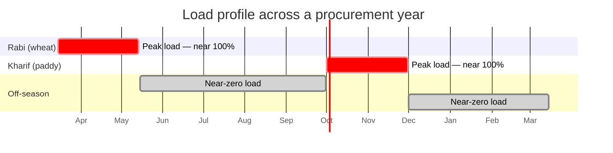

**~120 active days a year.** Design consequences:

| Concern | Approach |
|---|---|
| **Cost off-season** | Aggressive autoscale to near-zero. Serverless for the notification workers. Government budgets are scrutinised — this is a *pitch asset*, not just engineering. |
| **Peak burst** | Load is read-heavy (farmers checking status). Cache ETAs in Redis with short TTL; a status check must never touch Postgres. |
| **Morning write spike** | Gate scans cluster 06:00–10:00. Queue writes through Redis, batch-persist to Postgres. |
| **Natural sharding** | Partition by **state → district**. A farmer never queries across states. Districts scale independently. |
| **Rollout** | 1 district pilot → state → multi-state. Per-state deploys respect the fact that procurement rules genuinely differ. |

### Scaling path

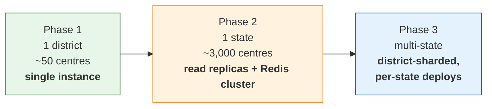

> ⚠️ **Centre and farmer counts above are planning assumptions.** Replace with real figures for your target state before pitching — a judge from DoCA will know the actual numbers.

---

## 16. Implementation roadmap

**The SIH trap is building seven features half-way.** Three working end-to-end beats seven on slides.

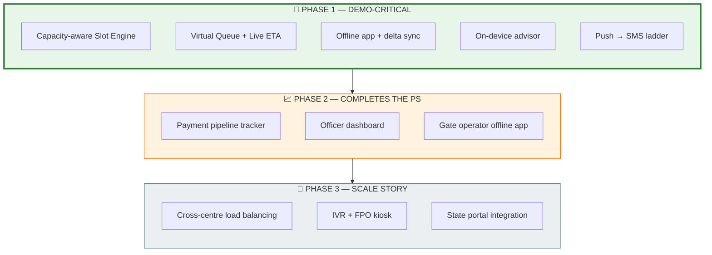

**Demo script — 6 minutes, one story:**

1. Officer logs bag shortage → capacity drops 62 → 47, **with the reason published**
2. Ramesh opens the app **in aeroplane mode** → still gets ranked slots → *"today 68% rejection risk, wait 2 days"*
3. Books Thursday. Centre slips 90 min → **push fires, then SMS on a second phone with data off**
4. Ramesh replans **from home**
5. Geofence activates the token on approach → gate scans **offline**
6. Payment tracker starts; force an SLA breach → officer dashboard lights up

Steps 2 and 3 are the ones judges will remember. Rehearse those until they cannot fail.

---

## 17. How we prove it works

Ship instrumentation from day one. A number beats an adjective.

| Metric | Baseline (today) | Target | Why it matters |
|---|---|---|---|
| **Trips per successful sale** | ~2.3 | **< 1.2** | The headline. Each avoided trip ≈ ₹1,500–4,000 saved. |
| **Time in yard** | 1–3 days | **< 3 hours** | The literal problem statement. |
| **ETA accuracy** (within ±30 min) | n/a | **> 85%** | Trust metric. Below 70%, the virtual queue collapses. |
| **Notification reach** (any channel) | n/a | **> 95%** | Proves the offline ladder works. |
| **Payment SLA compliance** | unmeasured | **> 90%** | Currently invisible — measuring it is itself a win. |
| **Advisor adoption** | n/a | **> 60%** follow the recommendation | Measures whether farmers actually believe us. |

> **Baselines are illustrative.** Establish real ones from your pilot district — an honest measured baseline is worth more in the pitch than an impressive guess.

---

## 18. Risks we're not hiding from

| Risk | Reality | Mitigation |
|---|---|---|
| **ETA that lies** | One bad prediction and farmers revert to 5 AM forever | Conservative estimates; always show a range; visible freshness stamps; publish accuracy openly |
| **Arhtiya resistance** | Commission agents profit from opacity and are politically influential | Position them as *users* — give them a bulk-booking role rather than routing around them |
| **Centre staff won't log inputs** | The capacity engine is worthless without daily bag/labour data | Make it 30 seconds on a phone; auto-fill from yesterday; the officer dashboard makes non-logging *visible* |
| **Low smartphone penetration** | A large share of the user base has feature phones | SMS + IVR are **first-class**, not fallback. The app is the *secondary* channel. |
| **State portal integration** | Every state's API differs, and some have none | Adapter pattern per state; degrade to CSV import; never block on integration |
| **Seasonal team amnesia** | 8 months between seasons; nobody remembers how it runs | Boring stack, thorough runbooks, no clever code |

---

## 19. Open decisions

Before writing code, settle these:

- [ ] **Which state?** Punjab / Haryana / MP / UP — flows differ meaningfully. Pick one and learn its existing portal *cold*. A specific credible demo beats a generic one.
- [ ] **Which crop?** Wheat (Rabi) and paddy (Kharif) have different moisture rules and rejection dynamics.
- [ ] **Real SLA values** from that state's actual procurement policy.
- [ ] **Real baselines** — current average wait, trips per sale, payment lag. Ask an FPO or a district office.
- [ ] **Does the target state's portal have an API?** Determines Phase 3 effort entirely.

---

## 20. Summary

**VAARI is not a booking app.**

It is a **live operations system** built on one insight: *the queue is a trust problem wearing a scheduling problem's clothes.* Publish real capacity with real reasons → farmers believe the number → they obey a virtual queue and follow an offline advisor → the dawn stampede and the wasted trips both disappear → and a transparent payment pipeline closes the loop that made them distrustful in the first place.

Everything in this document serves that chain. Anything that doesn't, we cut.

---

SIH 2026 · PS 26032 · Built for the Department of Consumer Affairs
